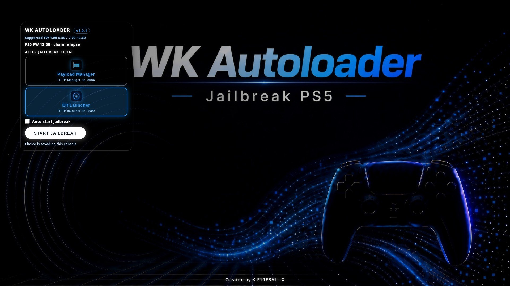
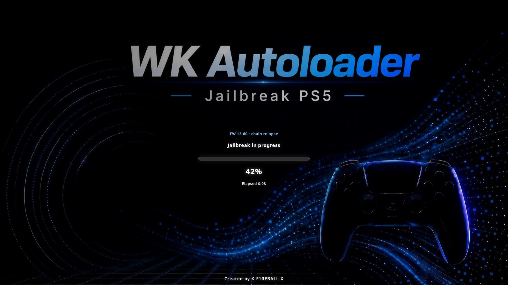

# WK Autoloader

PS5 homebrew: jailbreak UI on port **1022**. Chains: **umtx2** (1–5.xx), **relapse** (7.00–13.60).

Current release: **[v1.1.0](https://github.com/lamine5656/wk-autoloader-relapse/releases/tag/v1.1.0)** — download `installer.elf`.

**v1.1.0 highlights** — modern neon UI (French), **Payload Manager / autoload.txt mode as the default** post-JB launcher (same behavior as itsPLK's ps5-webkit-autoloader: your payloads listed in `autoload.txt` are loaded via elfldr, then the browser closes itself), SVG progress ring, animated background.

## Screenshots

<table>
  <tr>
    <td align="center" width="50%">
      <br/>
      <sub><b>Splash</b> — home screen</sub>
    </td>
    <td align="center" width="50%">
      <br/>
      <sub><b>Progress</b> — jailbreak running</sub>
    </td>
  </tr>
</table>

## Use

1. Download `installer.elf` from **[v1.1.0](https://github.com/lamine5656/wk-autoloader-relapse/releases/tag/v1.1.0)**.
2. Send it to elfldr (`9021`).
3. Open the home icon or `http://PS5_IP:1022`.
4. Pick **Payload Manager** (default, autoload.txt) or **Elf Launcher** (`:1000`), then **Lancer le jailbreak**.

## autoload.txt (Payload Manager mode — default)

After the jailbreak, WK Autoloader sends `payload.elf` (ps5-unified-autoloader), which:

1. Closes the WebKit browser by itself (return to home).
2. Looks for `autoload.txt`: USB root first (`/mnt/usb0-7/ps5_autoloader/`), then `/data/ps5_autoloader/`.
3. Sends every listed payload through elfldr, in order.

Prepare a `ps5_autoloader` folder with your `.elf` / `.bin` files and an `autoload.txt`
(one filename per line; `!1000` = sleep 1000 ms; `#` = comment). Put the folder on a USB
stick root, or copy it to `/data/ps5_autoloader` over FTP.

Example:

```
# Custom ELF loader first
elfldr.elf
# Give it 4 s to start listening
!4000
etaHEN.elf
```

> Without an `autoload.txt`, the payload automatically opens the Payload Manager web UI (`:8084`).

## Elf Launcher

For downloading and sending `elf-launcher.elf` via BinLoader (`elfldr`) on port `9021`, see the [Elf Launcher repository](https://github.com/X-F1REBALL-X/elf-launcher) and its [releases](https://github.com/X-F1REBALL-X/elf-launcher/releases). It is the companion UI bundled with WK Autoloader for loading ELF payloads.

## Firmware

| FW | Chain |
|----|-------|
| 1.xx–5.xx | umtx2 |
| 6.xx | unsupported |
| 7.00–13.60 | relapse |

## Credits

**Ohad / X-F1REBALL-X** — packaging, routing, UI.

### umtx2 (1.xx–5.xx)

[idlesauce/umtx2](https://github.com/idlesauce/umtx2): exploit largely from @shahrilnet / @n0llptr (lua UMTX); setup from @SpecterDev / @ChendoChap ([PS5-UMTX-Jailbreak](https://github.com/PS5Dev/PS5-UMTX-Jailbreak/)); PSFree by abc; ELF loader by @john-tornblom.

### Relapse (7.00–13.60)

ntfargo, ufm42, Sonic_Iso, Jordy, Dr. Yenyen, TheFlow, SlidyBat, Flatz, cow, nhk, bollarz, Sleirsgoevy, EchoStretch, EarthOnion

## Build

```bash
./tools/download_deps.sh
make clean all          # needs PS5 SDK at /opt/ps5-payload-sdk
# or: ./build_release.sh  # Docker
```
