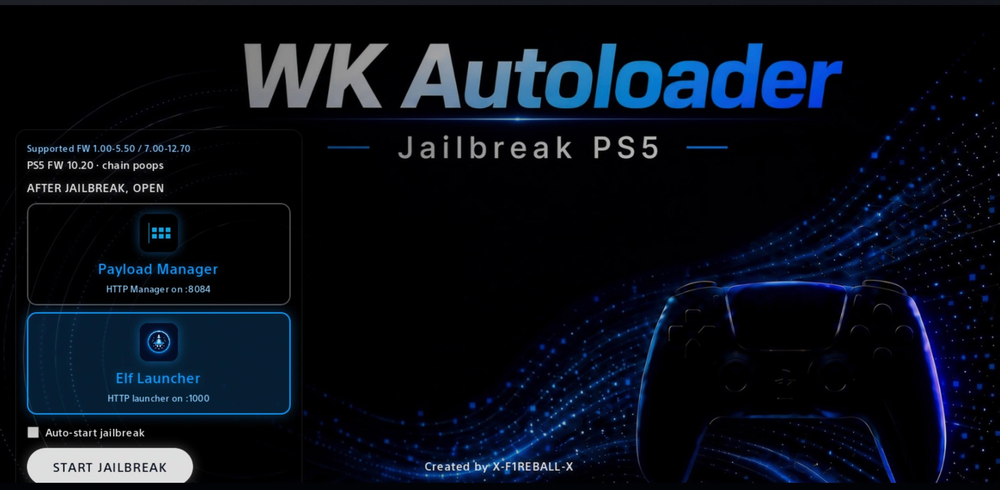

# WK Autoloader

  

WK Autoloader is installable homebrew for the PS5. It serves a jailbreak UI in the PS5 browser on port **1022**.

## How it works

1. Download `installer.elf` from the [latest release](https://github.com/X-F1REBALL-X/WK-AutoLoader/releases/latest).
2. Send it to elfldr on port **9021**.
3. Open the WK Autoloader home icon, or go to `http://PS5_IP:1022`.
4. Choose what to open after jailbreak:
   - **Payload Manager** - HTTP UI on `:8084`
   - **Elf Launcher** - HTTP UI on `:1000`
5. Press **Start Jailbreak**.
6. When jailbreak finishes, the launcher you chose opens.

For **Elf Launcher** to show and send payloads, unpack [elf-launcher-data.zip](https://github.com/X-F1REBALL-X/elf-launcher/releases/latest) into `/data/elf-launcher` on the console (FTP, usually port **2121**). Without that folder tree, Elf Launcher has nowhere to load files from.

## Supported firmware

- 1.xx-5.xx - kernel chain `umtx2`
- 7.00-12.00 - kernel chain `poops`
- 12.02-12.70 - kernel chain `p2jb` (about 45-50 minutes)

## Download

[Latest release](https://github.com/X-F1REBALL-X/WK-AutoLoader/releases/latest)

## Adding ELF files to Elf Launcher

1. Unpack `elf-launcher-data.zip` to `/data/elf-launcher` if it is not there yet.
2. Start FTP on the console (ftpsrv / etaHEN, usually port **2121**).
3. From a PC open `/data/elf-launcher/` and put your `.elf` files in the matching folder, for example:
   - `hen/` - HEN / jailbreak payloads
   - `apps/` - app installers
   - `files/` - FTP / file tools
   - `storage/` - dump / mount / saves
   - `media/` - players
   - `system/` - reboot / power / fan
   - `utils/` - extra tools
4. In Elf Launcher (`http://127.0.0.1:1000/`) press **Refresh** (Triangle).
5. Open the folder and press **Send** to load the ELF into elfldr (`9021`).

Repo: [elf-launcher](https://github.com/X-F1REBALL-X/elf-launcher)

## Credits

**X-F1REBALL-X**
