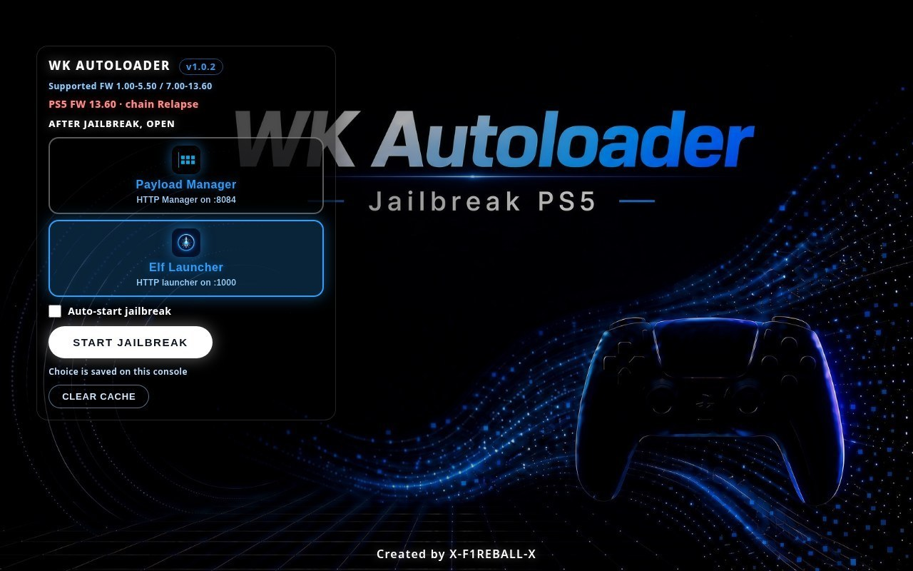

# WK Autoloader (Relapse / 7–13.60)

Private fork of WK Autoloader that vendors **Relapse** so PS5 firmware **7.00–13.60** jailbreaks inside WKAL (same Payload Manager / Elf Launcher flow). `umtx2` remains the default for **1.xx–5.xx**.

<p align="center">
  
</p>

WK Autoloader is installable homebrew for the PS5. It serves a jailbreak UI in the PS5 browser on port **1022**.

## How it works

1. Download `installer.elf` from the [latest release](https://github.com/X-F1REBALL-X/WK-AutoLoader/releases/latest).
2. Send it to elfldr on port **9021**.
3. Open the WK Autoloader home icon, or go to `http://PS5_IP:1022`.
4. Choose what to open after jailbreak:
   - **Payload Manager** - HTTP UI on `:8084`
   - **Elf Launcher** - HTTP UI on `:1000`
5. Press **Start Jailbreak**.
6. When jailbreak finishes, the launcher you chose opens.

For **Elf Launcher** to show and send payloads, unpack [elf-launcher-data.zip](https://github.com/X-F1REBALL-X/elf-launcher/releases/latest) into `/data/elf-launcher` on the console (FTP, usually port **2121**). Without that folder tree, Elf Launcher has nowhere to load files from.

## Supported firmware

- 1.xx-5.xx - kernel chain `umtx2`
- 7.00-13.60 - kernel chain `relapse` only (vendored under `frontend/autoloader/relapse/`; includes 13.42 and other Relapse-supported 7–13.xx). Default picker does **not** select `poops` or `p2jb` for this range.
- Force overrides still work: `?force=umtx2|relapse|poops|p2jb` or `FORCE_EXPLOIT=...` (legacy slopkit chains for testing only).

## Download

[Latest release](https://github.com/X-F1REBALL-X/WK-AutoLoader/releases/latest)

## Adding ELF files to Elf Launcher

1. Unpack `elf-launcher-data.zip` to `/data/elf-launcher` if it is not there yet.
2. Start FTP on the console (ftpsrv / etaHEN, usually port **2121**).
3. From a PC open `/data/elf-launcher/` and put your `.elf` files in the matching folder, for example:
   - `hen/` - HEN / jailbreak payloads
   - `apps/` - app installers
   - `files/` - FTP / file tools
   - `storage/` - dump / mount / saves
   - `media/` - players
   - `system/` - reboot / power / fan
   - `utils/` - extra tools
4. In Elf Launcher (`http://127.0.0.1:1000/`) press **Refresh** (Triangle).
5. Open the folder and press **Send** (English label) to load the ELF into elfldr (`9021`).

On the console `:1000` UI ([elf-launcher](https://github.com/X-F1REBALL-X/elf-launcher) `v1.0.5`):

- **Send** always re-sends; the row may show **Active** / **Sent** after a successful load.
- **Kill** appears on the row after a successful send / Active / Sent (PS5 + `:1000`).
- **Update** is a glowing gold button (brighter gradient + outer glow) shown only when a local `/data/elf-launcher` file is missing or outdated vs the catalog. It is never shown as a dead control, and it is hidden on GitHub Pages.
- Payload tree: unpack [elf-launcher-data.zip](https://github.com/X-F1REBALL-X/elf-launcher/releases/download/v1.0.5/elf-launcher-data.zip) into `/data/elf-launcher` (same payload set as v1.0.3/v1.0.4; also linked from [latest release](https://github.com/X-F1REBALL-X/elf-launcher/releases/latest)).

Repo: [elf-launcher](https://github.com/X-F1REBALL-X/elf-launcher) / release [v1.0.5](https://github.com/X-F1REBALL-X/elf-launcher/releases/tag/v1.0.5)

## Screenshots

Local captures of the Relapse default UI (no `poops` labels):

- `docs/screenshots/01-splash-relapse-13.60.png` — splash / launcher choice (`Supported FW … 7.00-13.60 · Relapse`, detect `chain Relapse`)
- `docs/screenshots/02-jailbreak-progress-relapse-13.60.png` — jailbreak progress (`FW 13.60 · chain Relapse`)
- `docs/screenshots/03-jailbreak-meta-relapse-13.60.png` — same progress view after Start

Also mirrored under `screenshots/` and `/workspace/artifacts/screenshots/`.

## Credits

**X-F1REBALL-X** — WK Autoloader Relapse fork (packaging, routing, UI).

Credits below are for the kernel chains actually vendored in this tree. No single “kernel finder” credit is claimed.

### umtx2 (default for 1.xx–5.xx)

Vendored from [idlesauce/umtx2](https://github.com/idlesauce/umtx2) (`third_party/umtx2`, `frontend/autoloader/umtx2/`).

Upstream lineage (from the umtx2 README): exploit code largely based on the lua UMTX work by @shahrilnet and @n0llptr; setup based on prior work by @SpecterDev and @ChendoChap ([PS5-UMTX-Jailbreak](https://github.com/PS5Dev/PS5-UMTX-Jailbreak/)); PSFree by abc; ELF loader by @john-tornblom.

### Relapse (default for 7.00–13.60)

Vendored under `frontend/autoloader/relapse/`. Plain-text credit list from the Relapse UI / lineage (as already in tree — `frontend/autoloader/relapse/src/site.js`):

ntfargo, ufm42, Sonic_Iso, Jordy, Dr. Yenyen, TheFlow, SlidyBat, Flatz, cow, nhk, bollarz, Sleirsgoevy, EchoStretch, EarthOnion

### poops / p2jb (force= only)

Still vendored via `frontend/autoloader/slopkit/` (from [itsPLK/slopkit](https://github.com/itsPLK/slopkit)) for `?force=poops|p2jb` / `FORCE_EXPLOIT` testing only — not selected by the default firmware picker.

Upstream credit line (slopkit README): Egy, Sonic, Yenyen, Zeco, Gezine, Echostretch, Ufm42, TheFloW, John Tornblom, Flatz, Idlesauce and PS5 R&D Discord.

## Build note (this private Relapse tree)

This repository is private. Relapse (7.00–13.60) is vendored under `frontend/autoloader/relapse/` and already wired in `app.js` / `tools/gen_file_registry.py`.

### Firmware routing (auto)

| FW range | Default chain |
|----------|---------------|
| 1.xx–5.xx | `umtx2` |
| 7.00–13.60 | `relapse` |
| other | unsupported |

`poops` / `p2jb` remain available only via `?force=` / `FORCE_EXPLOIT`.

### Without the PS5 SDK (Linux box / CI preview)

These steps regenerate prepared frontend copies, icons, staged `frontend/dist/`, AppCache (`frontend/dist/cache.appcache`), and the embedded registry sources (`include/file_registry.{h,c}`). Those outputs are gitignored — they are produced again at installer build time.

```bash
git submodule update --init --recursive
./tools/download_deps.sh
make slopkit-prepare umtx2-prepare
make include/.file_registry.stamp   # needs python3 + rsvg-convert (librsvg2-bin)
```

Force a chain with `?force=relapse|umtx2|poops|p2jb` or `FORCE_EXPLOIT=...` (default auto path is umtx2 / relapse as above).

### Remaining step: build `installer.elf` (needs PS5 SDK)

Blocked without `/opt/ps5-payload-sdk` (`prospero-clang`). On a machine with Docker:

```bash
./build_release.sh
# builds image from Dockerfile.sdk (ps5-payload-dev/sdk + libmicrohttpd),
# then: make clean all  ->  installer.elf
#       make host       ->  webkit-autoloader-host_v*.py
```

Or with the SDK already installed at `/opt/ps5-payload-sdk`:

```bash
./tools/download_deps.sh
make clean all          # installer.elf
# optional: make host   # PC host with embedded frontend
```
